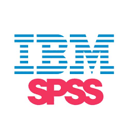
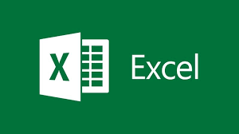
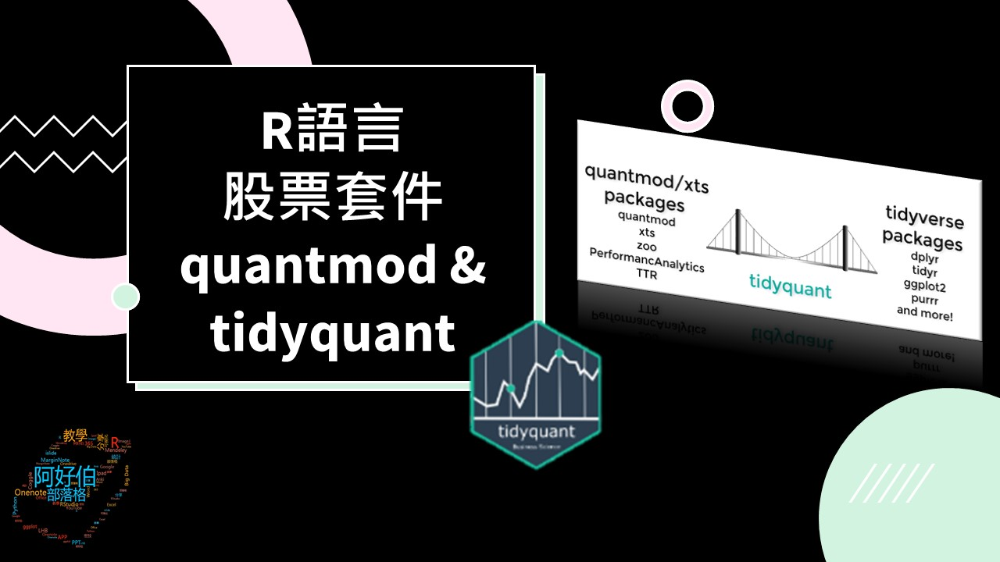
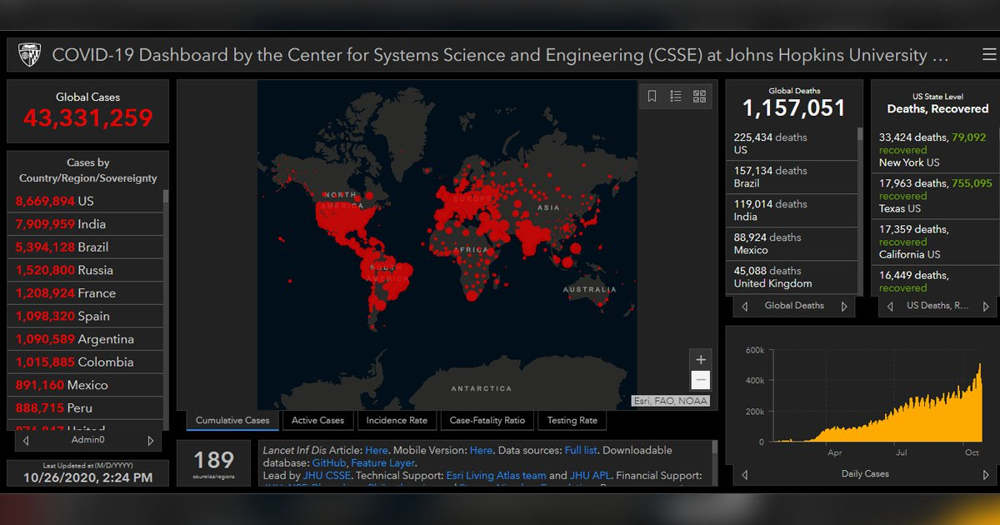
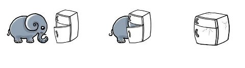
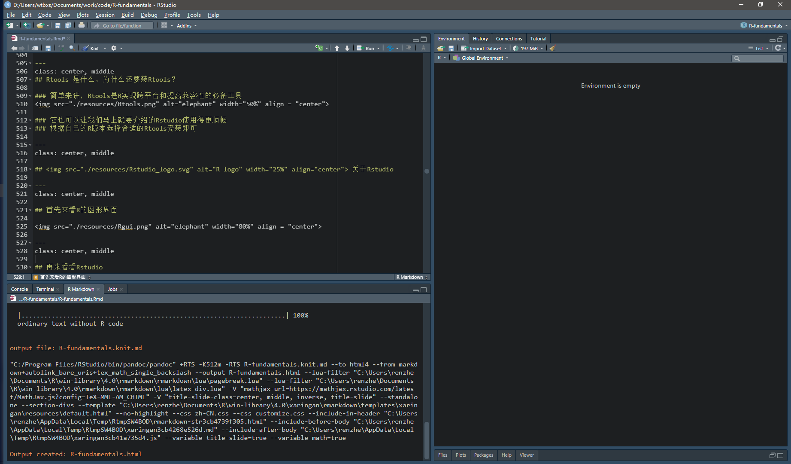
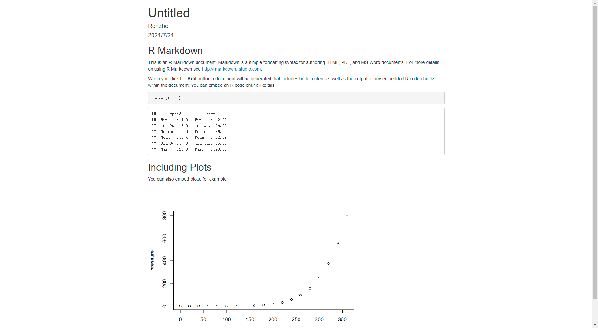
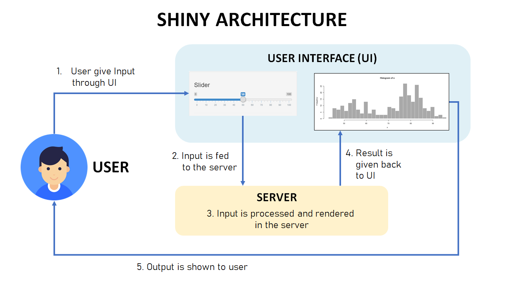
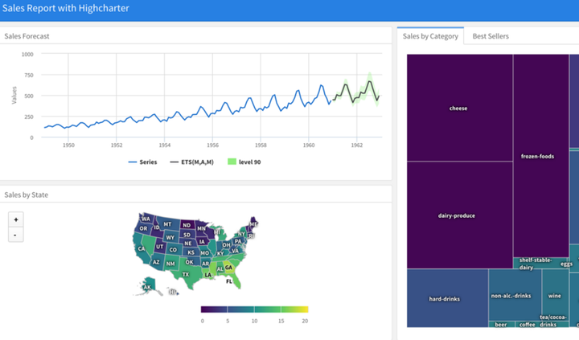
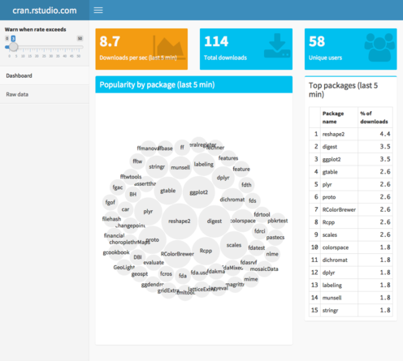

```{r setup, include=FALSE}
options(htmltools.dir.version = FALSE)
```
class: inverse, center, middle

# 正式开始之前

---
class: inverse, center, middle

# 哲学三问

--

## 我是谁？

--

## 我从哪里来？

--

## 我要去哪里？

---
class: inverse, center, middle

## 我的回答

--

## 我是谁

--

### “我”是/不是一个程序员

--

## 我从哪里来

--

### “我”已经可以/不可以熟练使用R/Excel/SPSS/...

--

## 我要去哪里

--

### “我”想了解R语言，想用R语言做更多...

---
class: inverse, center, middle

# 出发！

---
class: center, middle

# 在本教程中

--

## 你大概率**不**会用到笔记本电脑`r icons::fontawesome("laptop")`

--

## 你大概率**不**需要记笔记`r icons::fontawesome("book")`

--
<!-- ## 你大概率**不**需要连接Internet`r icons::fontawesome("wifi")` -->
## 当然如果你用笔记本记笔记我是很高兴的


---
class: center, middle

# 在本课程中你会了解到：

--

## R语言及R语言的应用领域

--

## Rstudio与Rmarkdown

---
class: center, middle

##  关于R语言

--

**R**是一门用于统计计算和作图的语言，受S语言和Scheme语言影响发展而来。

--

**R**语言最初由新西兰奥克兰大学统计系的Robert Gentleman和Ross Ihaka合作编写。

--

**R**语言具有免费、开源及统计模块齐全的特征，已被国外大量学术和科研机构采用，其应用范围涵盖了诸多领域。

--

.footnote[
.left[
 * S语言是一门用于数据分析和图示的高层语言。基于S语言开发的商业软件Splus，在外国学术界应用很广。
Scheme语言是LISP语言的一个方言(或说成变种)
]]

---
class: center, middle

## 在遇到R之前

--

## 你一定见过其他统计分析软件

--

 **SAS**: 速度快，有大量统计分析模块，可扩展性稍差，昂贵。

--

 **SPSS**: 复杂的用户图形界面，简单易学，但编程十分困难。

--

 **Splus**: 运行S语言，具有复杂的界面，与R完全兼容，昂贵。

--

 **Origin**: 无需编程基础，图表样式丰富，但定制化分析较为困难。


--

 **Excel**: 微软出品，功能强大，图形化界面易上手，但学习曲线比较陡峭，昂贵。

---
class: center, middle

# 为什么选择R？

--

### `r icons::fontawesome("cubes")` 广阔的应用领域

--

### `r icons::fontawesome("uncharted")` 丰富的资源（R包），良好的扩展性

--

### `r icons::fontawesome("question")` 完备的帮助系统，大量详尽的文档

--

### `r icons::fontawesome("money-check-alt")` 开源！GNU软件：大概率免费

---
class: center, middle
# `r icons::fontawesome("cubes")` 广阔的应用领域

.pull-left[
 #### Statistical & Data Science 统计和数据科学领域
 #### IT Sector 信息技术领域
 #### Finance 金融领域
 #### E-commerce 电子商务领域
 #### Social Media 社交媒体领域
 #### Life Science and Healthcare 生命健康领域
 #### Manufacturing 工业生产领域
 #### ......
]

.pull-right[

]

---
class: center, middle

## Statistical & Data Science 统计和数据科学领域

> "I keep saying that the sexy job in the next 10 years will be statisticians and, I’m not kidding."
> Chief Economist at Google says.

### R首先是一种统计学研究工具
### R也常被用来进行机器学习和人工智能相关研究

#### 真实世界中应用R的科研机构
#### Cornell University 康奈尔大学（全美Top20）使用R作为统计计算的首选语言
#### UCLA 加利福尼亚大学洛杉矶分校（全美Top5）使用R作为统计计算的教学语言

---
class: center, middle
## Statistical & Data Science 统计和数据科学领域

### Tidyverse ecosystem


---
class: center, middle
## Statistical & Data Science 统计和数据科学领域

### Tidymodels ecosystem


---
class: center, middle
## IT Sector 信息技术领域

.pull-left[

]

.pull-right[
#### 真实世界中应用R的IT公司
#### Microsoft 微软 
##### 使用R作为Azure机器学习平台的统计引擎
##### 开发了[R-open](https://mran.microsoft.com/open)作为高效数学计算的R发行版
#### Google 谷歌 
##### 使用R来改善搜索结果，提供个性化广告推荐
]

---
class: center, middle
## Finance 金融领域

.pull-left[
#### R为金融工作和计算提供了先进的统计学套件，包括自动回归，时间序列分析，股票市场模型，金融数据挖掘，量化分析，下游风险评估等等。 
#### 真实世界中应用R的金融公司
#### Lloyds of London 劳合社是全球最为知名的特殊保险与再保险市场
#### Bajaj Allianz Insurance 巴贾杰安联保险公司
]

.pull-right[

]

---
class: center, middle
## Finance 金融领域

### 股票和量化分析



---
class: center, middle
## Life Science and Healthcare 生命健康领域

.pull-left[

]

.pull-right[
#### R在药物发现，生物信息学，流行病学和公共卫生领域都有着大量应用
#### 真实世界中应用R的生物制药公司
#### Merck: 默克集团
#### 使用R进行临床试验设计评估和药物设计
]
---
class: center, middle
## Life Science and Healthcare 生命健康领域

### Covid-19 Map by Johns Hopkins




---
class: center, middle
## Life Science and Healthcare 生命健康领域

### Covid-19 Map by YuLab-SUM using R [nCov2019](https://github.com/YuLab-SMU/nCov2019)


---
class: center, middle

## 说得这么好，那么哪里可以找到这些R包呢？


---
class: center, middle
## `r icons::fontawesome("uncharted")` 丰富的资源（R包），良好的扩展性

--

### CRAN  [https://cran.r-project.org/](https://cran.r-project.org/)

--

### BioConductor  [https://www.bioconductor.org/](https://www.bioconductor.org/)


--

### R-OpenSci  [https://ropensci.org/](https://ropensci.org/)

--

### 当然还有大量的未发表的R包隐藏在全球最大的同性交友网站Github `r icons::fontawesome("github")`  [https://github.com/](https://github.com/)


---
class: center, middle
## `r icons::fontawesome("question")` 完备的帮助系统，大量详尽的文档

--

### CRAN task views 如何利用CRAN的R包来解决真实世界的问题
### [https://cran.r-project.org/web/views/](https://cran.r-project.org/web/views/)

--

### Bioconductor course 公开的R教程、视频资料
### [https://www.bioconductor.org/help/course-materials/](https://www.bioconductor.org/help/course-materials/)

--

### The R Journal 关于R和R包的在线杂志
### [https://journal.r-project.org/](https://journal.r-project.org/)

---
class: center, middle
## `r icons::fontawesome("money-check-alt")` 开源！免费！

--


---
class: center, middle
## 接下来

--

## 别担心，还没到开始写代码

--

## 想要正常使用R，让我们先把R部署到你的电脑上

---
class: center, top


# 把大象放进冰箱里需要几步？

--



---
background-image: url(./resources/cran.png)
background-position: center
background-size: contain
class: center, right

# 如何安装 R

--

### 打开R主页[https://cran.r-project.org/](https://cran.r-project.org/)

--

### 点击<u>Download for Windows</u>进入R for Windows页面

--

### 点击<u>install R for the first time</u>进入下载页面

--

### 点击<u>Download R 4.1.0 for Windows</u>下载安装包

--

### 安装

---
class: center, middle

# 这就够了？

--

# 还不够！

--

# 让我们先来聊聊这个安装包的名字:

--

# “R 4.1.0”

---
class: center, middle

# 软件的持续开发与部署

--


--

### 软件的持续开发意味着多次发布
### 多次发布之间需要有版本号进行区别
### 但是仅仅区分版本号还不够，如何快速分辨软件的依赖关系呢？

---
class: center, middle
# 语义化的版本控制

--


--

假设有个名为“救火车”的软件，它依赖于另一个名为“梯子”并已经有使用语义化版本控制的软件。当救火车创建时，梯子的版本号为 3.1.0。因为救火车使用了一些版本 3.1.0 所新增的功能，你可以放心地指定依赖于梯子的版本号大于等于 3.1.0 但小于 4.0.0。这样，当梯子版本 3.1.1 和 3.2.0 发布时，你可以将直接它们纳入你的包管理系统，因为它们能与原有依赖的软件兼容。

---
class: center, middle

## 再回来看“4.1.0”

### 4: 代表重大版本更新
### 1: 代表小版本更新
### 0: 代表错误修复

---
class: center, middle

### 除了版本号之外，每个R发布的版本都还会有一个别称
### 所有的版本别名都来自美国漫画连载《Peanuts》的系列名字
  
### 下面是最近的几个R发行版的名字，感兴趣可以自行检索

 * **4.1.0** "Camp Pontanezen" (original strip: 1986-02-12) (R version release data: 2021-05-18)
 * **4.0.5** "Shake and Throw" (original strip: 1978-07-30) (R version release date: 2021-03-31)
 * **4.0.4** "Lost Library Book" (original strip: 1959-03-02) (R version release date: 2021-02-15)
 * **4.0.3** "Bunny-Wunnies Freak Out" (original strip: 1972-10-23) (R version release date: 2020-10-10)
 * **4.0.2** "Taking Off Again" (original strip: 1962-04-14) (R version release date: 2020-06-22)
 * **4.0.1** "See Things Now" (original strip: 1962-02-06) (R version release date: 2020-06-06)
 * **4.0.0** "Arbor Day" (original strip: 1970-04-24) (R version release date: 2020-04-24)   

---
class: center, middle
## 在安装R时候的常见问题

--
### 我安装的R是3.5.3，那么在这个环境下开发的工具，能用在R 4.1.0吗？

--
### 我安装的R是4.1.0，那么在这个环境下开发的工具，能用在R 3.5.3吗？

--
### 我有必要更新到最新的R 4.1.0吗？

---
class: center, middle

## 好了好了，我明白了版本号了，也装了合适的R了，该开始用R了吧？

--

## One more thing

--

### 安装Rtools
### [https://cran.r-project.org/bin/windows/Rtools/history.html](https://cran.r-project.org/bin/windows/Rtools/history.html)

---
class: center, middle
## Rtools 是什么，为什么还要装Rtools？

### 简单来讲，Rtools是R实现跨平台和提高兼容性的必备工具


### 它也可以让我们马上就要介绍的Rstudio使用得更顺畅
### 根据自己的R版本选择合适的Rtools安装即可

---
class: center, middle

##  关于Rstudio

---
class: center, middle

## 首先来看R的图形界面


---
class: center, middle

## 再来看看Rstudio



---
class: center, middle

## 看起来好看多了，对吗

--

## 但我们并不只是奔着好看去的

---
class: center, middle

## Rstudio是R的集成开发环境
##（improved developer productivity, IDE）

### 它的优势包括但不限于：

### R的语法高亮和代码整理

### 代码的自动补齐（神奇的Tab键）

### 调用、查看函数库

### 编译代码，打包工具

### 交互式地展示代码执行结果，修改结果

---
class: center, middle

### 好了好了，知道是个好东西了，让我们赶紧来开始用Rstudio吧


---
class: center, middle

### 首先，Rstudio可以用来编写可执行的R代码

--

```{r comment='#'}
# 一个无聊的回归模型
fit = lm(dist ~ 1 + speed, data = cars)
coef(summary(fit))
dojutsu = c('地爆天星', '天照', '加具土命', '神威', '須佐能乎', '無限月読')
grep('天', dojutsu, value = TRUE)
```

--

### 但是这并不是我们今天的主要内容

---
class: center, middle

### 其次，还可以画图

--

```{r fig.height=3.5, dev='svg', message=FALSE}
library(tidyverse)
data(cars)
cars %>% ggplot(aes(x = speed, y = dist)) + 
  geom_point() + 
  geom_line()

```

---
class: center, middle
### 还可以画地图

```{r out.width='100%', fig.height=6, eval=require('leaflet')}
library(leaflet)
leaflet() %>% addTiles() %>% setView(-93.65, 42.0285, zoom = 17)
```

---
class: center, middle
### 还可以画表格

```{r eval=require('DT'), tidy=FALSE}
DT::datatable(
  head(iris, 4),
  fillContainer = FALSE, options = list(pageLength = 8)
)
```

--

### 但是这都不是我们今天的主要内容

---
class: center, middle

### 有一件事，你仅能在Rstudio上完美地实现，它就是

--

### Rmarkdown 

--


---
class: center, middle

### Rmarkdown顾名思义，就是R语言中的Markdown，那么什么是 Markdown?

--

> Markdown 是一种轻量级标记语言，创始人为 John Gruber。它允许人们「使用易读易写的纯文本格式编写文档，然后转换成有效的 XHTML（或者 HTML）文档」。
> from 维基百科

---
class: center, middle

### 说起编写文档，我用 Word 也可以实现同样的效果，为什么要使用 Markdown 呢？


--

#### 你一定经历过使用word排版的痛苦，比如毕业论文。
#### 也一定经历过当你把Word编写好的内容粘贴到网页上，出现格式错乱的时候。
#### 如果用Markdown，一切都会不一样

> Markdown 的本质是让我们回归到内容本身，注重文章本身的结构，而不是样式

---
class: center, middle

### 今天这里不会讲Markdown的语法
### 这里推荐3款兼容Markdown的文档编辑软件，大家上手之后一定会爱上Markdown

--

### Typora 

--

### 语雀 

--

### Notion 

---
class: center, middle

### 突然想起我们这是一场关于R的教程


### 让我们来看看如何用R来编写Markdown文档

---
class: center, middle

### 从菜单 `File -> New File -> R Markdown -> Documente` 填写作者和标题，创建一个新文档；

--


---
class: center, middle

### 点击 `Knit` 按钮编译文档；

--

### 恭喜你成功地制作了一份即时演算的Markdown文档！

--



> 当然它还很丑，如何美化它，那就是另一个的故事了

---
class: center, middle

## 动态可重复文档解决方案

在数据分析过程中通常的处理流程如下：

--

> **需求定义->数据收集->数据转化->数据分析->数据可视化**

--

而在需求快速变化的项目初期，为了快速确定需求，如何敏捷打造最小可用原型显然比项目工程化来得更有意义。

所以在现实中，这时候流程常常就会缩短成：

--

> **需求定义->数据整理->数据可视化**

--

数据整理：R

--

数据可视化：Rmarkdown

---
class: center, middle

# 再进一步

--

## 如果这个报告的输入也可以改变，所有的结果都适时地根据输入来显示

--

## 你是在说Shiny？

---
class: center, middle

## Shiny App



---
class: center, middle

## 依赖成熟的框架，可以快速地构建动态shinyapp

.pull-left[
### flexdashboard

]

.pull-right[
### shinydashboard

]
---
class: center, middle

## 这就是我们在国产质谱仪软件开发中完成的工作

--

## 敬请期待后续关于maldiSNP和Nutyper的内容！


---
class: center, middle

# 最后，蟹蟹

本幻灯片由 R 包 [**xaringan**](https://github.com/yihui/xaringan) 生成；

使得这一切变得可能的是 [remark.js](https://remarkjs.com)、[**knitr**](https://yihui.org/knitr)、以及 [R Markdown](https://rmarkdown.rstudio.com)。

主要参考资料：


 * https://techvidvan.com/tutorials/r-applications/
 * https://bookdown.org/yihui/rmarkdown/
 * https://bookdown.org/yihui/rmarkdown-cookbook/
 * https://www.coursera.org/learn/r-programming


